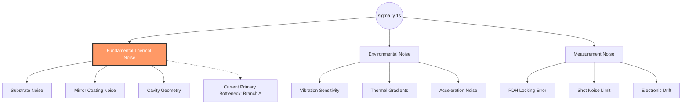

# 🏆 Sigma_y(1s) Technical Boundary Summary

## 1. Global SOTA Status
- **Current World Record**: `2.5e-17`
- **Leading Path**: `P3`
- **Overall Status**: `Determined`

---
## 2. Logic Decomposition Map (Reasoning Chain)

---
## 3. Performance vs. Complexity Trade-off Matrix

| Path | Estimated $\sigma_y$ | Perf Tier | Effort Tier | Primary Bottleneck | Strategy |
| :--- | :---: | :---: | :---: | :--- | :--- |
| P1 | 1e-16 | 3 | 2 | Amorphous Coating | Baseline |
| P2 | 5e-17 | 4 | 3 | Vibration/Symmetry | scaling L |
| P3 | 2.5e-17 | 5 | 5 | Mirror Coating | Cryo-Si |

**Legend**: Tier 1 (Lowest) $	o$ Tier 5 (Highest/Extreme)